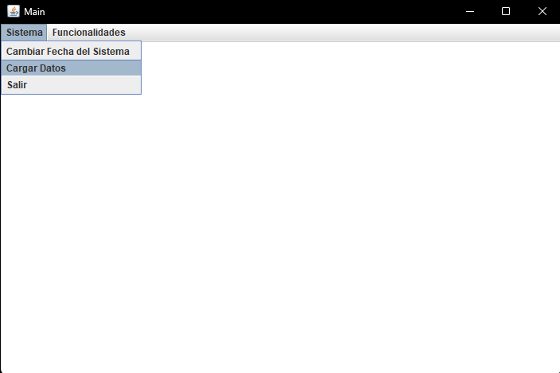

# EventosUY

## 📋 Descripción del Proyecto

**EventosUY** es una plataforma web para la gestión y organización de eventos en Uruguay. El proyecto permite a usuarios registrarse, crear eventos, seguir a otros organizadores, patrocinar eventos y registrarse como asistentes.

### Características Principales

- **Gestión de Eventos**: Crear, editar y consultar eventos
- **Categorías de Eventos**: Organización por categorías personalizables
- **Usuarios y Perfiles**: Sistema de usuarios con roles de organizadores y asistentes
- **Seguimiento**: Seguir a otros organizadores y eventos
- **Instituciones**: Gestión de instituciones relacionadas con los eventos
- **Patrocinios**: Sistema de gestión de patrocinadores
- **Reportes**: Generación de reportes en PDF

---

## 🏗️ Arquitectura del Proyecto

El proyecto está dividido en dos módulos principales:

### 1. **API (Backend)**
- **Ubicación**: `/api`
- **Tipo**: Servidor JAR independiente
- **Tecnología**: Java 21 + JAX-WS (Web Services)
- **Interfaz**: JavaX Swing
- **Puerto**: 8080
- **Descripción**: Servidor central que expone servicios web para todas las operaciones CRUD y lógica de negocio

### 2. **Web (Frontend)**
- **Ubicación**: `/web`
- **Tipo**: Aplicación WAR (Servlet)
- **Tecnología**: Java 21 + Jakarta EE
- **Servidor**: Apache Tomcat 11.0.13
- **Puerto**: 8081
- **Descripción**: Interfaz web que consume los servicios del backend

---

## 🛠️ Requisitos Previos

- **Java**: JDK 21 o superior
- **Maven**: 3.8.0 o superior
- **Git**: Para clonar el repositorio

### Verificar instalación

```bash
java -version
mvn -version
```

---

## 📦 Build (Compilación)

### En Windows

```bash
build.bat
```

### En Linux/macOS

```bash
./build.sh
```

### Qué hace el build

1. **Compila el módulo `api`**:
   - Ejecuta `mvn clean install`
   - Genera `ServidorWS-0.0.1-SNAPSHOT-jar-with-dependencies.jar`

2. **Compila el módulo `web`**:
   - Ejecuta `mvn clean install`
   - Genera `EventosUy-1.0.war.war`

3. **Copia datos de prueba**:
   - Copia archivos CSV a `target/datosPrueba/`
   - Copia recursos de upload a `target/src/webservices/uploads/`

### Salida esperada

```
✓ api/target/ServidorWS-0.0.1-SNAPSHOT-jar-with-dependencies.jar
✓ web/target/EventosUy-1.0.war
```

---

## 🚀 Deploy (Despliegue)

### En Windows

```bash
deploy.bat
```

### En Linux/macOS

```bash
./deploy.sh
```

### Qué hace el deploy

1. **Inicia el servidor API**:
   - Ejecuta el JAR en background
   - Puerto: 8080
   - URL: `http://localhost:8080`

2. **Detiene Tomcat** (si está corriendo)

3. **Despliega la aplicación web**:
   - Copia el WAR a `apache-tomcat-11.0.13/webapps/`
   - Inicia Tomcat

4. **Abre la aplicación**:
   - URL: `http://localhost:8081/EventosUy-1.0.war/HomeServlet`

---

## 🔧 Configuración

### Archivo: `application.properties`

```properties
server.url = http://localhost
server.port = 8080
```

Modifica estos valores si necesitas cambiar el puerto o la URL base del servidor.

---

## 🧪 Datos de Prueba

Los datos de prueba están en formato CSV en `/api/datosPrueba/`:

- `2025Usuarios.csv` - Usuarios registrados
- `2025Eventos.csv` - Eventos disponibles
- `2025Categorias.csv` - Categorías de eventos
- `2025Instituciones.csv` - Instituciones participantes
- `2025Patrocinios.csv` - Patrocinio de eventos
- `2025Registros.csv` - Registros de asistencia
- Y más...

Estos archivos se copian automáticamente durante el build a `target/datosPrueba/`.

---

## 📁 Carga de Datos

Se pueden cargar los datos de prueba desde la interfaz Swing de la API:


